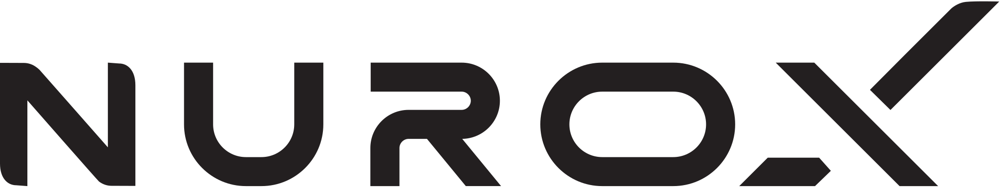
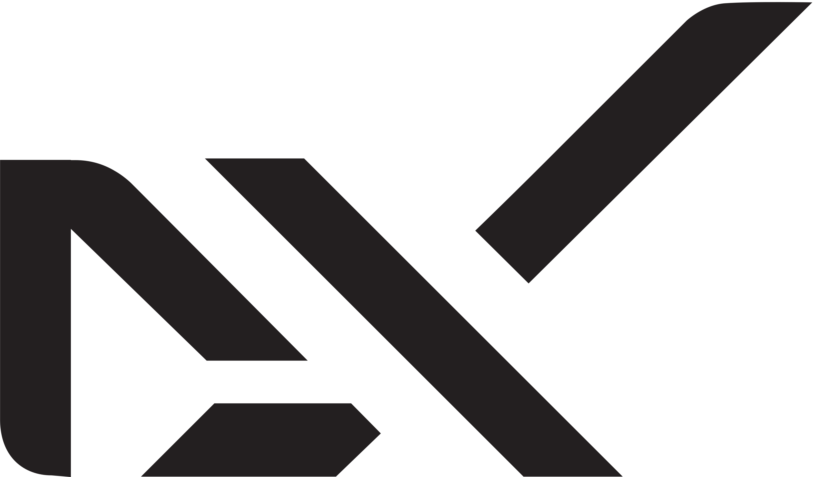

# Welcome to nuroX

  <picture>
    <source media="(prefers-color-scheme: dark)" srcset="logo_dark.svg" width="200">
    
  </picture>
  <h3>Engineer Emergence. Open Results.</h3>

## About nuroX

nuroX builds closed-loop, zero-trust platforms that learn in production, turning telemetry into measurable lift and emitting compliance by design—linking research to real-world outcomes in mission-critical environments.

We fuse informatics, management cybernetics, enterprise architecture, and zero-trust security to create self-improving platforms that sense, decide, act, and learn. Every action logs evidence, every loop improves outcomes—MTTR down, SLO up, risk reduced.

## Vision

Unite informatics, cybernetics, and zero-trust engineering with quantified processes to create closed-loop deployable platforms that learn, heal, and win lift—making system resilience and compliance properties of the system and gamifying mission-critical work while pushing the state of the art.

## Mission

Engineer emergence: fuse informatics, management cybernetics, enterprise architecture, and zero-trust security to build self-improving, closed-loop platforms (sense → decide → act → learn) that gamify mission-critical systems, operationalize resilience, and turn telemetry into measurable business lift—while pushing the state of the art through security-led, applied research that moves from lab to production.

## Core Principles

### Closed Loops, Open Results
Platforms sense → decide → act → learn with audit trails; outcomes visible in KPIs (MTTR↓, SLO↑, cost/incident↓).

### Zero-Trust, Operationalized
Identity, least-privilege, signed artifacts, attested deployments. Compliance is emitted as by-product evidence.

### Telemetry → Lift
Data becomes actionable control signals; every loop ties back to a measurable business objective.

### Mission-Critical by Design
Built for rail, aviation, and defense-grade operations where failure is expensive.

### Research to Production
Security-led, applied research integrated into delivery; ideas don't stall in the lab.

### Gamified Adoption
Make the right behaviors the easy, rewarding path; adoption generates compounding value.

## Getting Started

Visit our [official documentation](https://docs.nurox.ai) for comprehensive guides, tutorials, and API references.

## Documentation

### Public Documentation
- [Product Documentation](https://docs.nurox.ai)
- [API Reference](https://api.nurox.ai)
- [Developer Guides](https://docs.nurox.ai/guides)
- [Examples & Tutorials](https://docs.nurox.ai/tutorials)

### Internal Resources
- [nuroX Wiki](https://wiki.nurox.ai) - Internal developer documentation, architecture guides, and engineering standards (requires authentication)

## Organization Defaults

This repository contains organization-wide defaults that are automatically applied to all new repositories in the nuroX organization:

### Auto-Validation Workflows
- **Automatic GitHub Action validation** for repositories containing GitHub Actions
- **Smart detection** - only validates repositories with "action" in name + action.yml file
- **nuroX standards enforcement** - ensures compliance with organizational standards
- **Zero configuration** - works automatically for developers

[Learn more about organization defaults →](.github/README.md)

## Contributing

We welcome contributions to our open specifications and tooling repositories. Please read our [Contributing Guidelines](CONTRIBUTING.md) to get started.

### Before You Start

1. Review our [Code of Conduct](CODE_OF_CONDUCT.md)
2. Check the [Governance Model](GOVERNANCE.md)
3. Read the [Security Policy](SECURITY.md)

## Community & Support

- [Community Forums](https://community.nurox.ai)
- [Support Documentation](SUPPORT.md)
- [Stack Overflow](https://stackoverflow.com/questions/tagged/nurox)
- [Discord Community](https://discord.gg/nurox)

## Security

Security is our top priority. If you discover any security-related issues, please follow our [Security Policy](SECURITY.md) for responsible disclosure.

## License

nuroX software is proprietary unless explicitly designated as open source. Individual repositories contain their own license files. Specifications and tooling may be released under open source licenses—refer to each repository's LICENSE file for details.

## Recognition

Special thanks to all our [contributors](https://github.com/nuroX-global/contributors) who help make nuroX better every day.

## Connect With Us

- [Website](https://www.nurox.ai)
- [Blog](https://blog.nurox.ai)
- [Twitter](https://twitter.com/nuroXAI)
- [LinkedIn](https://linkedin.com/company/nurox)

---

  Built with excellence & ingenuity by the nuroX Team
    
  <picture>
    <source media="(prefers-color-scheme: dark)" srcset="white_x.png" width="50">
    
  </picture>

