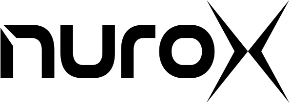

# Welcome to nuroX

  
  <h3>Shaping a future of data and business conciousness</h3>

## About nuroX

nuroX is pioneering the development of advanced AI systems and intelligent automation solutions. Our mission is to empower organizations with cutting-edge AI technology that drives innovation and operational excellence.

## 🌟 Key Features

- **Advanced AI Models**: State-of-the-art machine learning and deep learning solutions
- **Intelligent Automation**: Smart process automation and workflow optimization
- **Enterprise Integration**: Seamless integration with existing enterprise systems
- **Scalable Architecture**: Built for performance and scalability
- **Security-First Design**: Enterprise-grade security and compliance

## 🚀 Getting Started

Visit our [official documentation](https://docs.nurox.ai) for comprehensive guides, tutorials, and API references.

## 📖 Documentation

- [Product Documentation](https://docs.nurox.ai)
- [API Reference](https://api.nurox.ai)
- [Developer Guides](https://docs.nurox.ai/guides)
- [Examples & Tutorials](https://docs.nurox.ai/tutorials)

## 🤝 Contributing

We welcome contributions from the community! Please read our [Contributing Guidelines](CONTRIBUTING.md) to get started.

### Before You Start

1. Review our [Code of Conduct](CODE_OF_CONDUCT.md)
2. Check the [Governance Model](GOVERNANCE.md)
3. Read the [Security Policy](SECURITY.md)

## 💬 Community & Support

- [Community Forums](https://community.nurox.ai)
- [Support Documentation](SUPPORT.md)
- [Stack Overflow](https://stackoverflow.com/questions/tagged/nurox)
- [Discord Community](https://discord.gg/nurox)

## 🔒 Security

Security is our top priority. If you discover any security-related issues, please follow our [Security Policy](SECURITY.md) for responsible disclosure.

## 📄 License

nuroX is proprietary software. See our [LICENSE](LICENSE.md) file for details.

## ✨ Recognition

Special thanks to all our [contributors](https://github.com/nuroX-global/contributors) who help make nuroX better every day.

## 🌐 Connect With Us

- [Website](https://www.nurox.ai)
- [Blog](https://blog.nurox.ai)
- [Twitter](https://twitter.com/nuroXAI)
- [LinkedIn](https://linkedin.com/company/nurox)

---

  Built with excellence & ingenuity by the nuroX Team
    
  

